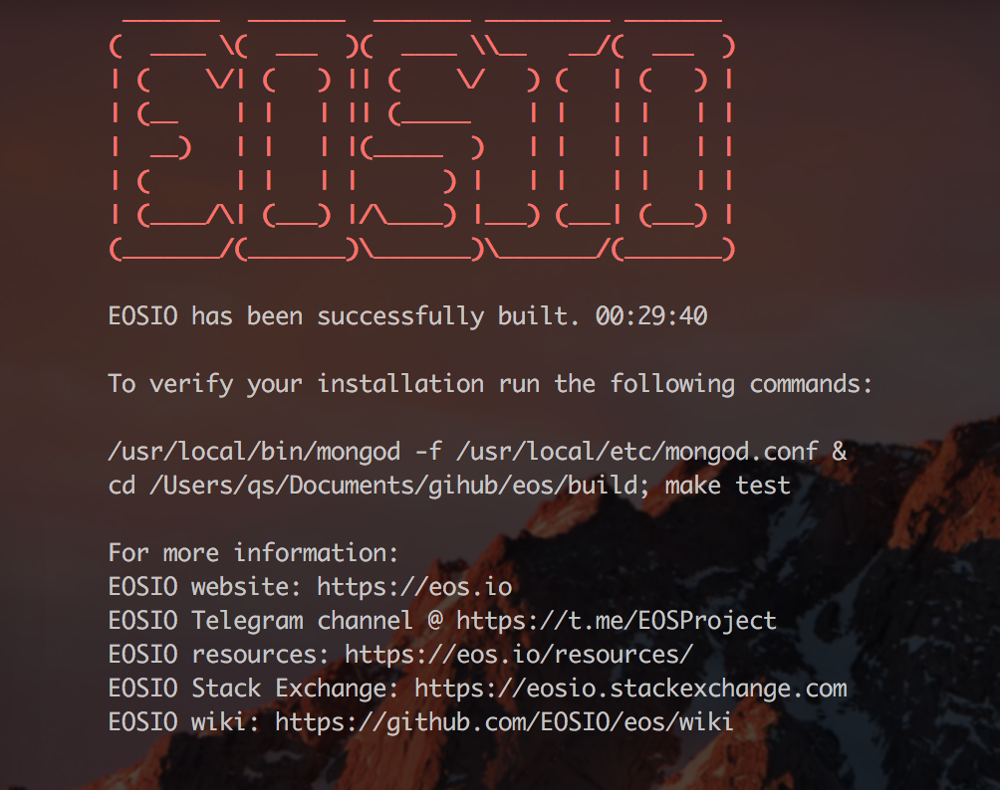

# 下载安装EOS运行环境

## 电脑配置:

>8GB RAM free required
>
>20GB Disk free required

## 下载源码
```
git clone https://github.com/EOSIO/eos --recursive
```
## 执行命令
```
./eosio_build.sh
```
## 安装成功


ps:受网络影像,安装不成功可多少尝试,或者科学上网.

安装目录

On Linux platforms:

```
~/opt/mongodb/bin/mongod -f ~/opt/mongodb/mongod.conf &
```
On MacOS:

```
/usr/local/bin/mongod -f /usr/local/etc/mongod.conf &
```

## 安装可执行文件
```	
cd build

sudo make install
```

## 启动单节点测试环境
```
cd build/programs/nodeos

./nodeos -e -p eosio --plugin eosio::chain_api_plugin --plugin eosio::history_api_plugin 

nodeos -e -p eosio --plugin eosio::chain_api_plugin --plugin eosio::history_api_plugin --contracts-console --filter-on "*"
```

--

## docker 
```
nodeos -e -p eosio     --plugin eosio::producer_plugin     --plugin eosio::history_plugin     --plugin eosio::chain_api_plugin     --plugin eosio::history_api_plugin     --plugin eosio::http_plugin     -d /mnt/dev/data     --config-dir /mnt/dev/config     --http-server-address=0.0.0.0:8888     --access-control-allow-origin=*     --contracts-console     --http-validate-host=false --filter-on "*"
```
-- 

遇到问题可以在公众号评论/或者[github](https://github.com/qs-lll/EosGuide)中提出
